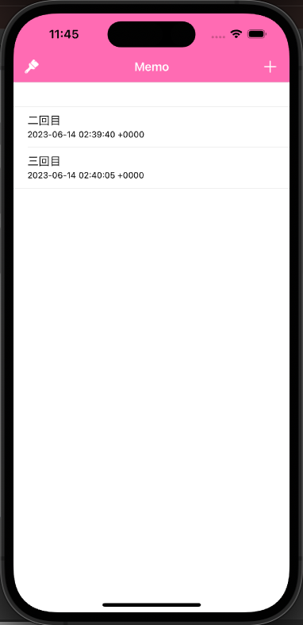

# メモアプリ「ver.1_playground」　



---

### 【使用システム】

<div>


</div>

<hr>

## 🎤 システム概要

簡単なメモ帳です

## 🎤 機能

- [x] 背景色を変更
- [x] メモの記入、編集
- [x] データ保存

## 🎤 使用環境

- macOS
- Xcode

## 🎤 インストール

```
$ git clone https://github.com/〜〜 //クローンする
$ cd 〜〜 //クローンしたディレクトリに移動する
```

## 🎤 使い方

1. 「＋」：メモ内容を追加できます
2. 「刷毛」：メモ帳の色を変更できます
3. 記入済みのメモ内容を編集できます

## 🎤 作者

- 萩 巧実
